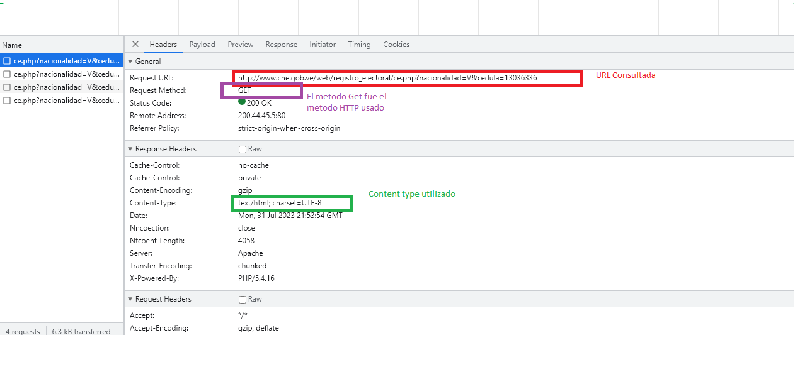
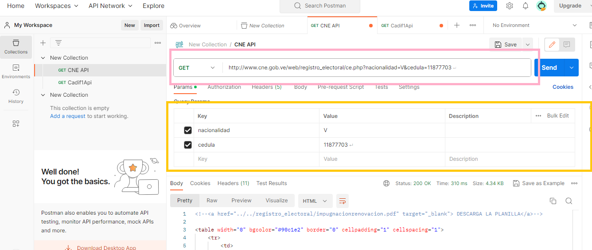
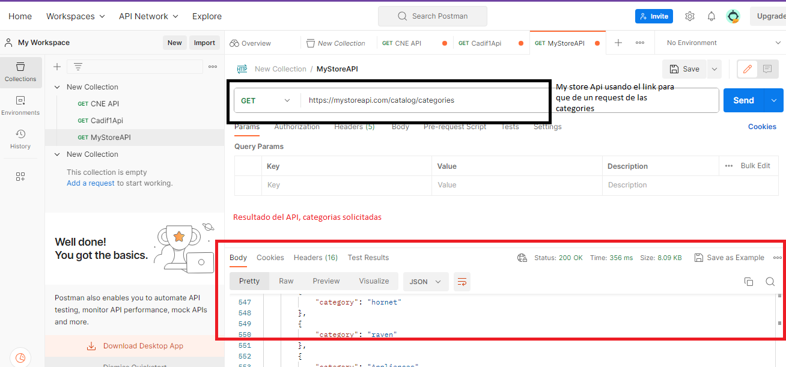

# Desafio 1
Enunciado: 
Con el navegador de su preferencia, visitar la URL http://www.cne.gob.ve/web/index.php. Abrir la herramienta network del navegador para luego hacer una consulta de cédula de identidad en el registro electoral, colocando cualquier número de cédula. Luego responder los siguientes requerimientos:
1.- Revisando la información que muestra la herramienta network del navegador luego de consultar la cédula, debe responder: cuál es la URL consultada, cuál es el método HTTP usado en la consulta y cuál es el content-type de la respuesta. Haga una captura de pantalla remarcando las respuestas

2.- ¿Cómo se llaman los parámetros que se envían al backend cuando se hace el "request"?

3.- En Postman, agregue un nuevo "request", para hacer la misma petición que hace el sitio http://www.cne.gob.ve/web/index.php para consultar una cédula. Haga una captura de pantalla donde se visualice el request en Postman y la respuesta obtenida del backend

4.- Visitar la URL https://mystoreapi.com para leer la documentación de esta API. En Postman, registre un "request" para hacer consultas (read) de categorías

5.- Buscar en la página web oficial la documentación del API de alguna plataforma en línea que Ud utilice con frecuencia (que no sea ni Facebook, WhatsApp, Instagram o alguna de las herramientas de Google). Describa de forma general los pasos que debe seguir para usar esa API, según lo que describe la documentación. NOTA: las plataformas que tienen APIs, generalmente colocan un link con el texto "Developers", en donde se consigue información para programadores

# Respuestas
## 1.
Imagen Con los requerimientos de la primera parte

## 2.
Los parámetros usados son  **nacionalidad** con el valor **V** y **cedula**

## 3

Imagen del requerimiento 3

## 4
Imagen del requerimiento 4

## 5 
La API que voy a utilizar es thecocktaildb una api de consulta de tragos, cocteles y otras bebidas alcholicas 

[Sitio ofical y otra documentacion](https://www.thecocktaildb.com/)

[Documentacion de la API](https://rapidapi.com/thecocktaildb/api/the-cocktail-db)

Para utilizar esta api se usa por defecto el número 1 como api key

Podemos hacer consultas de los distintos tragos usando el parametro "s" para buscar un nombre completo. ejemeplo

https://www.thecocktaildb.com/api/json/v1/1/search.php?s=margarita

si queremos buscar una lista de objetos JSON con tragos que comiencen con una letra en especifica usamos el parametro "f"

https://www.thecocktaildb.com/api/json/v1/1/search.php?f=c

Si queremos buscar por ingredientes usamos el parametro "i" y nos saldran objetos JSON que cumplan con ese ingrediente. Ejemplo

