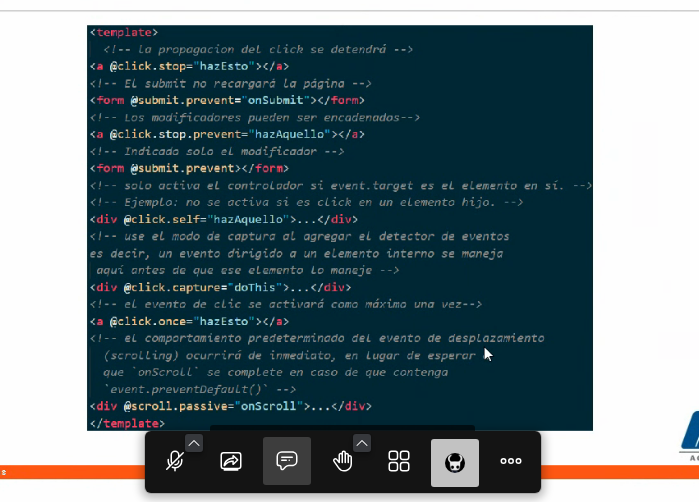

# Notas
## Actividad 1

1. Crear una respuesta al click del contenedor #subHeader.
2. Dar click a cualquier div hijo de #subHeader.
3. Evitar la propagacion con el modificador de evento de Vue.
4. Maquetar en el div de "search" un formulario para la "busqueda".
 4.1 El formulario debe tener un input:text y input submit
5. Preveer la recarga de la pagina al hacer submit en el formulario de "busqueda".
6. Evitar que se pueda copiar texto del inpur del formulario de busqueda. 

## Notas
Eventos de 
